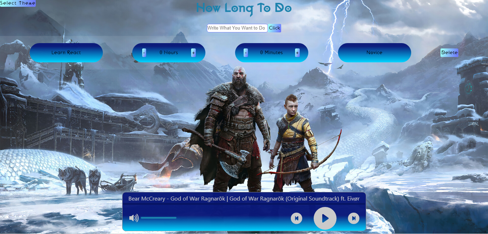
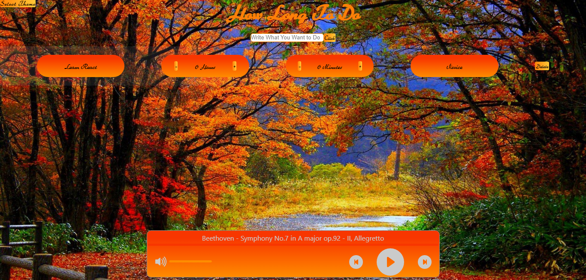
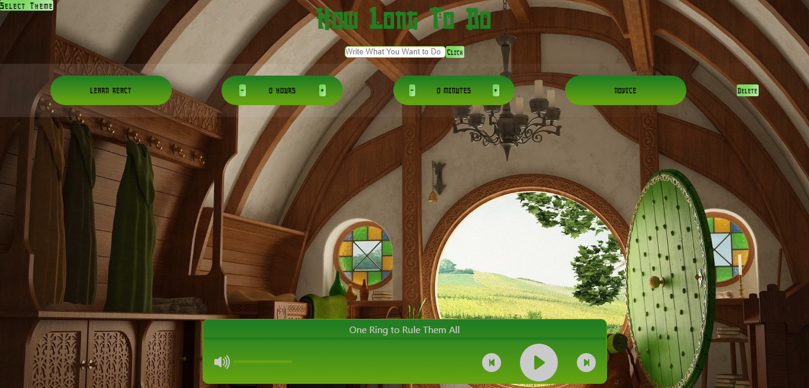
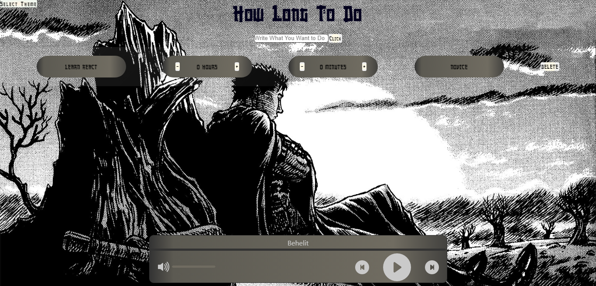
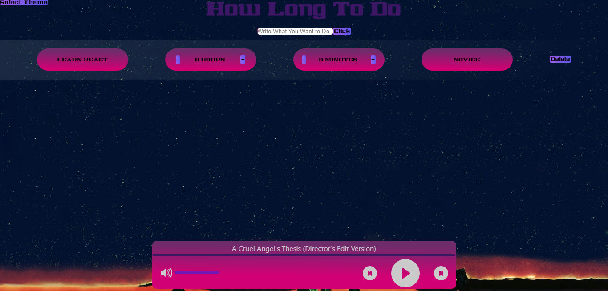

# How Long To Do App

*This app aims to write down the things you want and  how many hours you spend.*

-----

*The List has 5 section. These are:*
* *To write whatever you want*
* *How many hours you spent*
* *How many minutes you spent*
* *The level of do your things.The level of learning has 5 stages including Novice,Advanced Beginner,Competence	Proficient,Expert*
* *Delete button* 

*
Sample of the list
*

*This application also has a music player.You can listen to the theme-appropriate music.

*
Music player
*

## ***Main menu*** 

*This is a main menu of application.You can choose your theme.There is six themes of this application.*

## ***Themes:***
* *God of War Ragnarok*

  
* *Classic Music*

  
* *Lord of the Rings*

  
* *Star Wars*

  
* *Berserk*

* *Neon genesis Evangelion*
  

